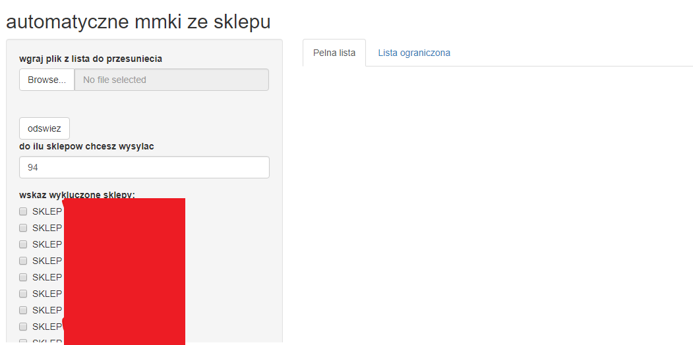
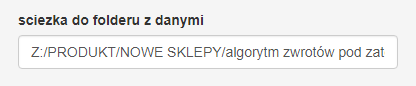
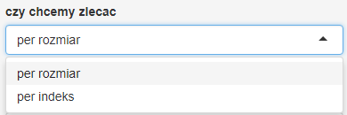
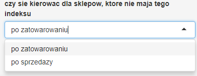
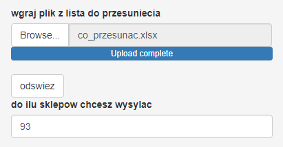
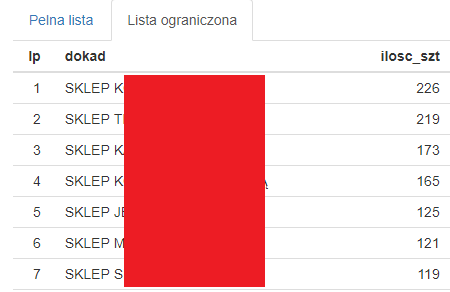
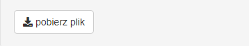

# aplikacja_algorytm_automatyczne_MMKi

### Skrypt jest narzedziem wykorzystywanym w celu wygenerowania listy zlecen dla wskazanego sklepu

Narzedzie zostalo przygotowane w jezyku R, przy pomocy R Shiny.
Dane wrażliwe zostały ocenzurowane.

## Źródło danych

Plik jest zasilany następującymi danymi zewnętrznymi:
- lista indekso-rozmiarów na których chcemy wykonać ruchy towarowe,
- sprzedaż z ostatniego miesiąca,
- biężące stany sklepowe i magazynowe, 
- aktualny poziom zatowarowania sklepu,
- hierarchia produktów,
- wiekowanie produktów.

## Schemat działania
---

Skrypt tworzy ranking sklepów najbardziej niedotowarowanych w ramach danej kategorii produktowej o najlepszym potencjale sprzedażowym oraz dodatkowo nieposiadającym lub posiadającym w niewielkich ilościach dany produkt.

Na tej podstawie algorytm zawarty w skrypcie wskazuje do jakiego sklepu najlepiej przenieść konkretny produkt (z zejściem do pojedyńcego rozmiaru) ze wskazanej puli produktów.

Jako rezultat działania skryptu otrzymujemy listę, w formacie csv, którą możemy wgrać do systemu produkcyjnego, przekazując tym samym dyspozycji do wskazanych salonów.

## Korzyści
---

Wykorzystując skrypt udało się zaoszczędzić 6 roboczogodzin raz na 2 tygodnie, plus ten skrypt był inicjatorem kolejnych rozwiązań w obszarze zarządzania towarem.  
Dodatkowo wybór odbiorców wskazanych ruchów towarowych nie jest przypadkowa tylko uzasadniona danymi statystycznymi. 
Oprócz tego udało się również wykluczyć błąd ludzki polegający na wytypowaniu zbyt dużej ilości sklepów, co zawsze wiazało się z dodatkowymi kosztami przesyłek (skrypt koncentruje ruchy towarowe i dąży do utworzenia jak najmniejszej liczby przesyłek).

## Szczegółowy opis funkcjonalności
---

Na wstępie wgrywamy plik ze wskazanego miejsca na serwerze

&nbsp;

W tym kroku możemy już wybrać do ilu salonów chcemy kierować nasze paczki.  
Decyzję możemy podjąć również po uzyskaniu wstępnych wyników.

&nbsp;

W kolejnym kroku wskazujemy sklepy, do których na pewno nie chcemy nic wysyłać.  
Powody mogą być różne: tymczasowe zamknięcie, nowe salony, inny koncept.  
Lista dopuszcza multiwybór.  

&nbsp;

Ważnym elementem jest wskazanie poniżej salonu z którego wykonujemy ruchu.
Ta informacja pojawi się na liście zleceń, ustawiając nam ten sklep jako dawce, a także wykluczy go z listy potencjalnych biorców.

&nbsp;

Ze względu na wykorzystywania narzędzia przez różnych użytkowników została powołana opcja podawania ścieżki gdzie znajdują się najświeższe dane wsadowe (oprócz listy indeksów do przeniesienia).  
Dla ułatwienia ustawiona jest domyślna ścieżka.

&nbsp;

Kolejne elementy to różne opcje pracy algorytmu, domyślnie ustawione są te najpopularniejsze.  
Możemy wybrać sposób sortowania sklepów uwzględniając w pierwszej kolejności:
- bieżące zatowarowanie danym indekso-rozmiarem na sklepie,
- sprzedaż per indeks,
- poziom zatowarowania na sklepie,
- bieżące zatowarowanie danym indeksem na sklepie.

&nbsp;

Możemy wybierać jak bardzo szczegółowo chcemy analizować potencjał, czy schodząc do indekso-rozmiaru, czy tylko na poziomie całego indeksu.

&nbsp;

Ważnym elementem pracy algorytmu jest część kodu, która definiuje jego zachowanie gdy napotka na sytuacje, że dany indeks nie występuje na żadnym innym sklepie.  
Algorytm ma wtedy 2 opcje, zleca wysyłke produktu do sklepu, który ma największe zapotrzebowanie na tego typu asortyment lub uzyskuje najwyższe obroty.

&nbsp;

Aby skrypt mógł się uruchomić należy po wgraniu wszystkich potrzebnych danych i ustawień kliknąć opcję "odśwież".

&nbsp;

## Wyniki
---

Skrypt po odświeżeniu danych, po kilku minutach pracy, generuje nam podsumowanie, prezentujące jak będą wyglądać zlecenia, do jakich salonów i po ile szt.
Na podstawie tych danych możemy podjąć decyzję o ograniczeniu zleceń do X salonów.

Wynik po ograniczeniach zaprezentowany jest w zakładce "Lista ograniczona".

&nbsp;

Gdy rezultat pracy algorytmu jest satysfakcjonujący, u dołu alplikacji klikamy w opcję "pobierz plik".

&nbsp;

**Rezultatem powyższych działań jest plik csv, w poniższym układzie:**

| LP |Indeks | Rozmiar| Ilosc | Dawca | Biorca|
|----|---|---------|---------|--------|-----------------|
|    |   |         |         |        |                 |
|    |   |         |         |        |                 |
|    |   |         |         |        |                 |
