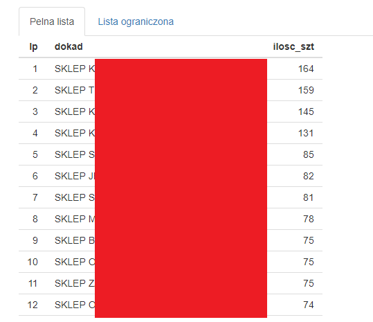

# aplikacja_algorytm_automatyczne_MMKi

### The script is a tool used to generate a list of freight movements for a given store

The tool was prepared in R language with R Shiny.
Sensitive data has been censored

## Data source

The file is fed with the following external data:
- index-size list on which we want to make goods movements,
- last month's sales,
- current store and warehouse stocks,
- the current level of stocking the store,
- product hierarchy,
- age of products.

## Scheme of operation
---

The script creates a ranking of the most under-supplied stores in a given product category with the best sales potential and, additionally, with no or small amounts of a given product.

On this basis, the algorithm contained in the script indicates which store it is best to move a specific product (descending to a single size) from the indicated range of products.

As a result of the script operation, we receive a list in csv format, which we can upload to the production system, thus transferring the instructions to the indicated stores.

## Profits
---

Using the script, it was possible to save 6 man-hours.
In addition, the choice of recipients of the indicated goods movements is not accidental, it was also possible to exclude a human error consisting in selecting too many stores, which always involves additional shipping costs.

## Detailed description of functionality
---

At the beginning, we upload the file from the indicated place on the server

&nbsp;

In this step, we can already choose how many stores we want to send our parcels to.
We can also make a decision after obtaining preliminary results.

&nbsp;

In the next step, we indicate stores to which we certainly do not want to send anything.
The reasons may be different: temporary closure, new stores, a different concept.
The list allows a multi-selection.  

&nbsp;

An important element is to indicate below the store from which we make the movement.
This information will appear on the list of movements, setting this shop as a giver, and will also exclude it from the list of potential recipients.

&nbsp;

Due to the fact that the tool is used by various users, the option of specifying the path where the latest batch data is located (apart from the list of indexes to be transferred) has been introduced.
A default path is set for user convenience.

&nbsp;

The next elements are various options of the algorithm's operation, the most popular ones are set by default.
We can choose the method of sorting stores, taking into account in the first place:
- current stocking with a given index-size in the store,
- sale per index,
- stock level in the store,
- current stocking with a given index in the store.

&nbsp;

We can choose if we want to analyze in detail the potential, whether going down to the index-size or only at the level of the entire index.

&nbsp;

An important element of the algorithm's work is the part of the code that defines its behavior when it encounters situations where a given index is not present in any other store.  
The algorithm then has 2 options, orders the product to be shipped to the store that has the greatest demand for this type of product or achieves the highest turnover.

&nbsp;

In order for the script to run, after uploading all the necessary data and settings, click "refresh".

&nbsp;

## Results
---

After refreshing the data, after a few minutes of work, the script generates a summary of what the orders will look like, to which stores and how many pcs.
Based on this data, we can decide to limit orders to X stores.

The result after the limitations is presented in the tab "Lista ograniczona".

&nbsp;

When the result of the algorithm's work is satisfactory, at the bottom of the application, click the "download file" option.

&nbsp;

**The result of the above actions is a csv file, in the following layout:**

| LP |Articel | Size| Pcs | From | To|
|----|---|---------|---------|--------|-----------------|
|    |   |         |         |        |                 |
|    |   |         |         |        |                 |
|    |   |         |         |        |                 |